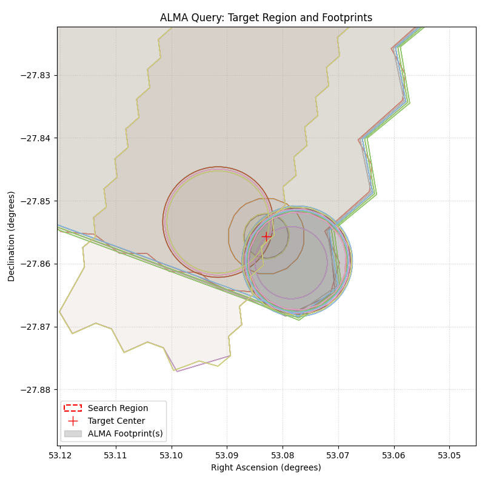

# ALMA Archive Region Tool

This repository provides a set of tools to query the ALMA science archive for observations around specific coordinates and convert the returned footprints (`s_region`) into SAOImage DS9 region files (`.reg`) for visualization over FITS maps.

## Files
- `search_alma.py`: Queries the ALMA archive using `astroquery`. Outputs the results as a CSV file.
- `csv_to_ds9.py`: Converts the generated CSV file containing ALMA footprints into a standard DS9 `.reg` file.
- `run_all.sh`: Example bash script to run the full pipeline synchronously from the command line.
- `example_usage.ipynb`: A Jupyter Notebook demonstrating how to use the scripts programmatically, parse the output, and generate inline visualizations using `matplotlib`.

## Visualization Example

The `example_usage.ipynb` notebook maps out the returned ALMA observation footprints, generating an image like the following (accounting for the RA aspect ratio scaling by declination):



## Usage

### Using the Notebook
Open `example_usage.ipynb` in VS Code or Jupyter and follow the interactive instructions to specify your target RA, Dec, and search radius.

### Using the Command Line
You can use the shell script for a quick query. It uses a heredoc to pass coordinates and radius:
```bash
./run_all.sh
```